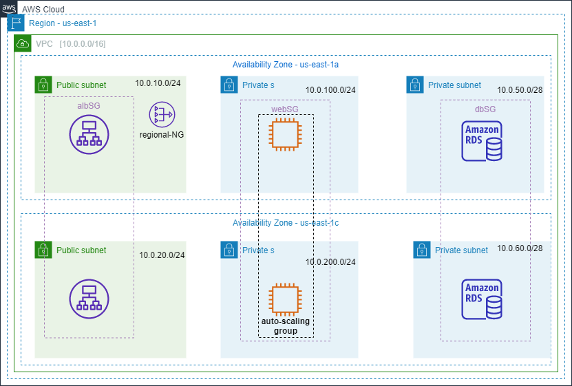

# AWS Multi-Tier Application Infrastructure with Terraform


## Overview

This project demonstrates how to provision a multi-tier AWS infrastructure using **Terraform**.

The infrastructure is designed with separate network tiers for public-facing resources, application servers, and the database layer. It includes a custom VPC, multiple Availability Zones, public and private subnets, an Application Load Balancer, an Auto Scaling Group, NAT Gateway, and a highly available Amazon RDS MySQL database.

The main goal of this project is to practice and demonstrate **Infrastructure as Code (IaC)**, AWS networking, high availability, security groups, load balancing, auto scaling, and managed database deployment using Terraform.

---

## Architecture

The infrastructure is deployed in the AWS `us-east-1` region across two Availability Zones:

- `us-east-1a`
- `us-east-1c`

### Architecture Diagram



### Architecture Flow

```text
                         Internet
                            |
                            v
                +-----------------------+
                |   Application Load    |
                |      Balancer         |
                +-----------+-----------+
                            |
                            v
                +-----------------------+
                |   Target Group        |
                +-----------+-----------+
                            |
                            v
                 +----------------------+
                 | Auto Scaling Group   |
                 |      EC2 Instances   |
                 +----------+-----------+
                            |
                            | MySQL :3306
                            v
              +---------------------------+
              |       Amazon RDS          |
              |       MySQL Multi-AZ      |
              +-------------+-------------+
                            |
                    +-------+-------+
                    |               |
                    v               v
              AZ us-east-1a   AZ us-east-1c
                 Primary          Standby
